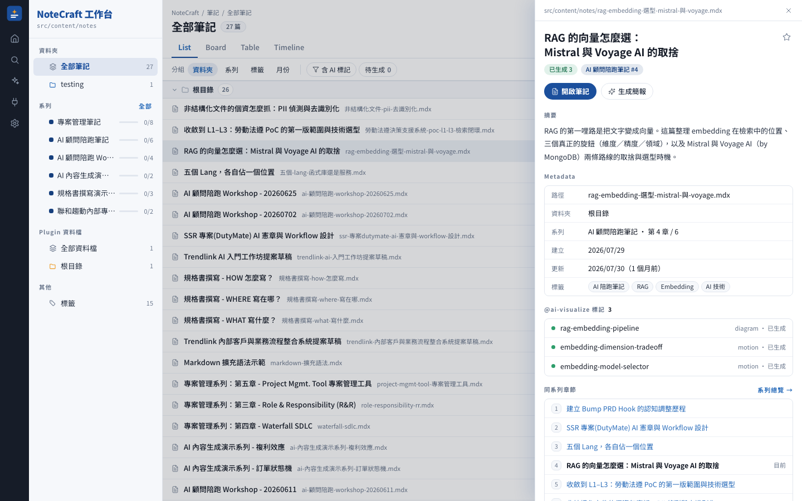
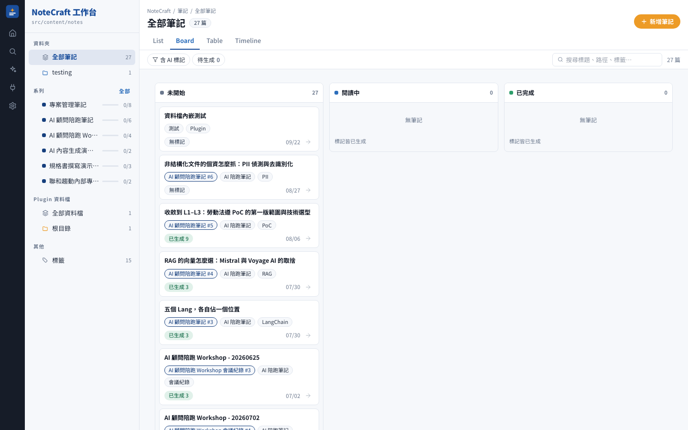
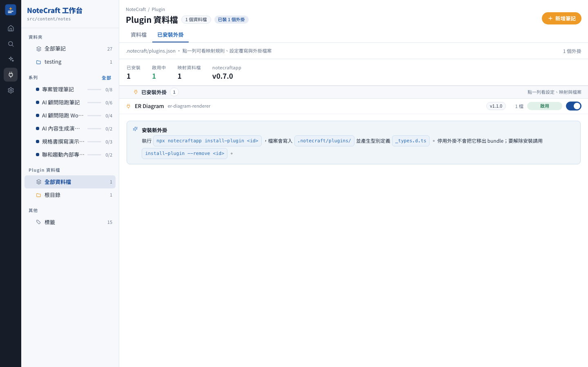

<!--
  截圖用相對路徑，GitHub 直接 render；npm.js 會依 package.json.repository 欄位
  自動 rewrite 成 raw.githubusercontent.com 對應路徑。所以只要記得 publish 前把
  package.json 的 repository 填成真實 GitHub URL 就行。
-->

# NoteCraftApp

**由 AI 生成視覺化與動態互動元件、嵌入筆記的個人筆記 Web App。**

用 `npx` 一行指令在任何專案的 md/mdx 資料夾啟動漂亮 UI；搭配 [Claude Code](https://claude.com/claude-code)，讓 AI 把 MDX 中的「這裡放張流程圖」標記自動變成 React 互動元件、寫回筆記。

<p>
  <a href="https://www.npmjs.com/package/notecraftapp"></a>
  <a href="#系統需求"></a>
  <a href="#license"></a>
</p>


<details>
<summary>更多畫面：筆記列表、Drawer 預覽、Board、Plugin 管理</summary>

**筆記列表（List view）** — 依資料夾／系列／標籤／月份分組，篩選全在網址參數，`⌘K` 隨時跨頁跳轉。


**Drawer 預覽** — 單擊一列在右側預覽摘要、Metadata、`@ai-visualize` 標記與同系列章節；雙擊或列尾的箭頭才進筆記。



**Board view** — 依閱讀狀態分三欄，拖曳卡片就改狀態。



**Plugin 管理** — 已安裝外掛、映射規則、命中的資料檔，dev 下可一鍵啟用／停用。



</details>

---

## 為什麼要 NoteCraftApp

傳統筆記工具只能顯示文字。當你想把一段流程講清楚、把兩個方案並排比較、或讓讀者親手拖動看兩種策略的差異——只能貼靜態圖或放連結。NoteCraftApp 讓「知識能被看見、被操作」：

- **AI 視覺化** — MDX 內用 `@ai-visualize` 標記描述你想要的圖表 / 時序 / 動畫 / 互動；Claude Code 讀懂後產生 React 元件、自動嵌入筆記。`npx notecraftapp init-skill` 一鍵把 skill 裝到你的專案
- **放大檢視** — 內文欄寬容不下的元件（並排結構圖、RACI 矩陣、寬表格），一鍵搬進全螢幕的可拖曳平移、可縮放畫布來讀，**互動完整保留**，還能匯出 100% 原尺寸 PNG
- **筆記轉簡報** — 一篇筆記一鍵變成 16:9 多頁簡報，`/present/<slug>` 可全螢幕播放。**筆記裡的互動元件原樣搬進投影片，播放時照樣能點、能拖**
- **即時 preview** — `serve` 內建背景 rebuild + SSE auto reload：Claude Code 在另一個 terminal 寫檔、viewer 這邊瀏覽器自動刷新，全程免手動重啟
- **工作台（v1.0.0）** — 三欄殼：Rail + 檔案樹 Sidebar + 主區。筆記列表有 List／Board／Table／Timeline 四種 view 與側邊 Drawer 預覽，Board 拖曳即改閱讀狀態；`⌘K` 指令面板跨頁跳轉並含 pagefind 全文搜尋
- **儀表板** — widget grid：筆記總數、近 8 週寫作頻率、最近更新、系列進度（一鍵繼續閱讀）、標籤分布、待生成標記；另有「本週」「AI 佇列」兩個 Tab
- **系列** — 多份筆記串成有順序的閱讀路徑，含進度條與單鍵推進；資料檔頁也能是一章
- **Plugin** — 結構化 JSON 交給可安裝的渲染器畫成頁面；`/plugins` 看得到映射規則、命中檔與外掛檔案，可在 dev 一鍵啟用／停用
- **巢狀資料夾原生支援** — `guides/oauth/flow.mdx` 直接對到 `/notes/guides/oauth/flow`
- **缺 frontmatter 也能顯示** — 標題從 H1 或檔名抓、日期從檔案 mtime 抓
- **MDX 相對圖片路徑**（``）自動解析
- **HMR 寫入** — `view` 模式在 UI 新增 / 編輯 / 刪除筆記，瀏覽器即時反映

---

## 三層體驗

### 靜態層（v1 已上）

只是一行 `npx notecraftapp view ./docs`，你就能得到儀表板、系列、標籤、巢狀 URL、圖片、寫入 UI——完整的閱讀 + 輕量編輯體驗。**MDX 中的 `@ai-visualize` 標記會以「待生成」卡片顯示**，等你之後動手處理。

### AI 生成層（v0.2.0 已上）

真正的招牌功能——**由 AI 把「這裡放張圖」的自然語言描述變成互動元件**。

**一次性安裝**（把 3 個 skill 與 6 個 subagent 設定裝到當前專案的 `.claude/`）：

```bash
npx notecraftapp init-skill
# 檢查已安裝版本與可升級版本
npx notecraftapp init-skill --check
```

之後在 MDX 中寫：

```mdx
{/* @ai-visualize
id: oauth-flow
type: diagram
status: pending
prompt: |
  畫一張 OAuth 2.0 + PKCE 的完整時序圖，
  含前端、後端、AS、Resource Server 四方通訊
*/}
```

在 Claude Code 中對筆記說「處理這個標記」，NoteCraft 的 `content-visualize` skill 會：

1. **note-scanner** 掃描檔案找出所有 `@ai-visualize` 標記
2. **visualize-planner** 依 prompt 決定用手寫 SVG / recharts / d3 / motion 等
3. **component-generator** 產出 React 元件到 `.notecraft/components/<id>.tsx`；產出前先 lint import 白名單、白名單外套件走「徵詢作者」路徑不撞 build
4. **mdx-writer** 在 MDX 標記下方插入 `import` 與 `<Component client:visible />`
5. 更新標記的 `status` 為 `generated`

**同時另開 terminal 跑 `npx notecraftapp serve ./notes`**——內建背景 watcher + SSE，AI 一寫檔瀏覽器就自動 reload，兩邊各司其職不用手動刷新。

#### 放大檢視（v0.5.0 起）

生成元件是為內文欄寬（約 720px）設計的，但並排雙欄結構圖、RACI 矩陣、寬表格在那個寬度下會被擠壓、橫向溢出。**每個元件的外框卡片標題列都有一顆「放大檢視」**——點下去進入全螢幕畫布：

- **拖曳平移、滾輪縮放**，雙擊空白處還原置中，`Esc` 關閉
- **元件互動完整保留**——該點的照樣能點、該拖的照樣能拖；指標在元件上時事件交給元件，不會誤觸畫布平移
- **版面真的變寬**（v0.5.1 起）——放大檢視的紙張寬度依視窗計算（880–1600px），不是把原尺寸放大而已；會依容器寬度重排的元件因此能攤開成更適合橫向視窗的形狀
- **匯出 PNG**——白底、2x、固定 1600px 寬，不受當下縮放與平移影響，同一張圖在不同螢幕匯出結果一致

畫布就是簡報 `full-visual` 版型那塊，兩邊共用同一套平移縮放行為。dev 與正式環境皆可用。

### 簡報層（v0.4.0 起改為「選頁填字」）

**把整篇筆記變成一份可全螢幕播放的簡報**——不是把文字塞進投影片模板，而是重新抓主線、切章節、選版型。

在 Claude Code 中說「把 `<筆記>` 轉成簡報」（或點筆記頁功能列的「生成簡報」複製提示詞），`content-present` skill 會：

1. **present-planner** 讀整篇筆記，抓出主線、判定是內部備忘還是對外提案、**逐頁從 29 個原子裡選一個**
2. **slide-generator** 產出 `<slug>.deck.tsx`，跑型別與 build 驗證
3. 你在 `/present/<slug>` 檢視或全螢幕播放

**內容頁的預設是「挑一個原子、把資料填進去」，不是每頁重新設計版面。** 原子分兩層：15 個**整頁級**（定位矩陣、累計拆解、決策記錄、風險研判、取捨光譜…）預期獨佔一頁，且**同一份簡報內不得重複**——所以頁頁不同是規則保證的，不靠運氣；另外 14 個**組合級**（清單、卡片、流程、圖表、程式碼…）可並排使用。

挑不到才降級成自己寫版面，且要寫明理由。這讓 AI 的力氣從「排版」轉回「內容」——實測同一篇筆記，deck 檔從 716 行降到 264 行。

外框版型仍是 6 種，其中 5 種（封面、章節分隔、引言、結語、全幅視覺）結構固定由系統渲染。

**筆記裡既有的 `@ai-visualize` 元件會原樣嵌入**——播放到那一頁，該點的照樣能點、該拖的照樣能拖，不會退化成靜態截圖。

---

## Quick Start

在你的 md/mdx 資料夾所在專案下：

```bash
# 一次性檢視（推薦）
npx notecraftapp view ./docs

# 或全域安裝
npm install -g notecraftapp
notecraftapp view ./docs
```

首次執行會複製套件到 `~/.notecraft/app-<version>/` 並跑一次 `npm install`（~30 秒）。之後每次啟動秒開。

---

## 五個子命令

### `notecraftapp init-skill`

一次性把 **3 個 skill（`content-visualize`、`content-present`、`trendlink-design`）與 6 個 subagent** 設定安裝到當前專案的 `.claude/`，讓 Claude Code 能處理 `@ai-visualize` 標記與筆記轉簡報。裝完就能在你自己的專案內跑這兩條 AI pipeline。

```bash
npx notecraftapp init-skill              # 首次安裝到 cwd
npx notecraftapp init-skill --check      # 版本比對、不寫檔
npx notecraftapp init-skill --force      # 直接覆寫本地已改過的 skill
npx notecraftapp init-skill --dir <path> # 指定安裝目標 root
```

衝突處理：有本地手改過的檔案時，走互動 prompt（`overwrite / skip / overwrite-all / skip-all / abort`）；非 TTY 環境（CI）且未帶 `--force` → 直接拒絕、exit 1。

適合：**第一次要在自己專案跑 AI 視覺化的時候跑一次即可**。

### `notecraftapp install-plugin [source]`

裝一個 **plugin** —— 把專案裡的結構化 JSON 資料檔畫成頁面的渲染器。不帶參數時列出官方 store 讓你選。

```bash
npx notecraftapp install-plugin                          # 列官方 store、互動選擇
npx notecraftapp install-plugin er-diagram-renderer      # 裝官方 plugin
npx notecraftapp install-plugin owner/repo/plugins/foo   # 裝第三方（可帶 #v1.2.0 指定版本）
npx notecraftapp install-plugin ./my-plugin              # 本地開發中的 plugin
npx notecraftapp install-plugin --list                   # 只看清單
npx notecraftapp install-plugin --remove er-diagram-renderer
```

裝完在 `.notecraft/plugins.json` 加一條映射，符合的檔案就會變成 `/view/<路徑>` 的頁面：

```json
{ "plugins": [{ "plugin": "er-diagram-renderer", "files": ["**/*.er.json"] }] }
```

（帶 `--apply "**/*.er.json"` 可以讓它直接幫你寫進去。）

**安裝前一律要你確認一次。** 這是在你的 build 與瀏覽器裡執行別人寫的前端程式碼，
所以確認前會先擋下：白名單外的 `import`、`dangerouslySetInnerHTML`、
可執行檔（`*.sh`、`*.mjs`、`package.json`…）、路徑逃脫，以及 `engines` 不相容的版本。
**不會執行任何安裝腳本。** CI 環境用 `--yes` 略過確認。

資料檔可以和筆記一起排進系列（`series.json` 的 `slugs` 寫 `view:<路徑去副檔名>`），
也可以用 `<PluginView src="..." />` 嵌在 MDX 內文裡。

### `notecraftapp view <dir>`

啟動 Astro dev server，HMR + 可寫入。**新增/編輯/刪除筆記瀏覽器即時反映**。

適合：邊寫邊看、快速迭代、日常使用。


### `notecraftapp build <dir>`

把該資料夾 build 成靜態 HTML，產物在 `~/.notecraft/cache/<hash>/dist/`。有快取失效偵測（mtime / fileCount / config），改了東西下次自動 rebuild。

適合：CI、生成後想部署到別的地方。

### `notecraftapp serve <dir>`

Node HTTP 靜態伺服器，服務 `build` 產物的 dist。**預設帶背景 rebuild + auto reload**（`--no-watch` 退回純靜態）：

- 內建 chokidar watcher 監看 `.md` / `.mdx` / `.notecraft/components/*.tsx` / `.notecraft/*.json`
- 檔案變動 → debounce 300ms → `astro build` 到 `dist.next/` → `rename` 原子交換 → 保留舊 dist 若 rebuild 失敗
- SSE `/__notecraft/events` 通知瀏覽器 auto reload（客戶端 script inline 注入 HTML）
- 首次 build 失敗仍上線 fallback 頁——修好 mdx 後 SSE 觸發 auto reload 拿到真頁面
- **純唯讀**——沒有寫入 API，「新增筆記」按鈕自動隱藏

適合：**觀察 AI 生成**（Claude Code 在另一個 terminal 寫檔、viewer 這邊自動反映）、內部團隊分享、Demo 站、放到內網。

---

## 進階

### Frontmatter：全 optional

不用任何 frontmatter 也能 render；缺什麼欄位自動補：

| 欄位          | Fallback 策略                       |
| :------------ | :---------------------------------- |
| `title`       | 內文第一個 `# H1` → 檔名 Title Case |
| `description` | 內文第一段前 220 字                 |
| `createdAt`   | 檔案 birthtime → mtime              |
| `updatedAt`   | 檔案 mtime                          |
| `tags`        | 空陣列                              |

一份純 markdown 也能顯示：

```md
# 我的筆記

隨手寫的第一段就是 description。
```

### 系列（可選）：`.notecraft/series.json`

放一個 `.notecraft/series.json`，串多篇筆記成有順序的閱讀路徑。**兩個位置都會被讀取**：

- `<notes 資料夾>/.notecraft/series.json`（近的、優先）
- `<專案根>/.notecraft/series.json`（例如 `notecraftapp view ./docs`，series.json 放在專案 root）

範例內容：

```jsonc
{
  "series": [
    {
      "id": "auth-guide",
      "title": "驗證機制指南",
      "eyebrow": "AUTH GUIDE",
      "description": "從 session 到 OAuth 的完整路徑",
      "accent": "blue",
      "icon": "target",
      "slugs": [
        "auth/basic",
        "auth/session-cookie",
        "auth/jwt",
        "auth/oauth-flow",
      ],
    },
  ],
}
```

- `accent`：`"blue" | "orange" | "navy"`
- `icon`：`"target" | "code" | "layers" | "bookOpen" | "bolt"`
- `slugs`：檔案相對 notes 資料夾的路徑（去副檔名），順序即章節順序


沒有 `series.json` 就沒事，`/series` 頁只顯示引導文案。

### 巢狀資料夾

Slug 保留階層：

| 檔案                    | URL                        |
| :---------------------- | :------------------------- |
| `hello.mdx`             | `/notes/hello`             |
| `guides/setup.mdx`      | `/notes/guides/setup`      |
| `guides/oauth/flow.mdx` | `/notes/guides/oauth/flow` |

### 圖片：直接寫相對路徑

MDX 或 md 內 `` / `` 都會被自動 rewrite 成 `/notes-assets/*` URL，由內建靜態伺服器從你的 notes 資料夾直接送。

支援 png / jpg / svg / webp / gif / avif / ico / pdf。

### 寫入 UI

`view` 模式下右上角「+ 新增筆記」按鈕會出現，可以：

- 建立新筆記（自動 slug、frontmatter 模板）
- 編輯標籤（chip 介面 + 標籤自動完成）
- 刪除筆記
- 「以 VS Code 編輯」快速跳轉


寫入路徑安全：

- API 只綁定 `127.0.0.1`，拒絕外部連線
- 所有路徑走 `path.resolve` + prefix 檢查 + `fs.realpath` symlink 防護
- 一律鎖定在你指定的 notes 資料夾底下

---

## CLI Flags

### `view` 與 `serve` 共通

| Flag         | 預設        | 說明                              |
| :----------- | :---------- | :-------------------------------- |
| `--port <n>` | `4321`      | 伺服器 port                       |
| `--host <h>` | `127.0.0.1` | 綁定 host（`0.0.0.0` 曝光到 LAN） |

### 額外

| Flag         | 適用命令      | 說明                                          |
| :----------- | :------------ | :-------------------------------------------- |
| `--no-open`  | serve         | 不自動開瀏覽器                                |
| `--rebuild`  | build / serve | 強制 rebuild，忽略快取                        |
| `--no-watch` | serve         | 關閉背景 rebuild + SSE，回到純靜態、唯讀行為  |

### `init-skill`

| Flag           | 預設   | 說明                                            |
| :------------- | :----- | :---------------------------------------------- |
| `--force`      | false  | 衝突檔直接覆寫，不 prompt                       |
| `--check`      | false  | 只印安裝狀態與版本比對，不寫檔                  |
| `--dir <path>` | cwd    | 安裝目標 root（一般不用）                       |

### `install-plugin`

| Flag             | 預設           | 說明                                      |
| :--------------- | :------------- | :---------------------------------------- |
| `--list`         | false          | 只列官方 store，不安裝                    |
| `--remove <id>`  | —              | 移除已安裝的 plugin（會檢查設定是否殘留） |
| `--apply <glob>` | —              | 安裝後把映射寫進 `plugins.json`           |
| `--ref <tag>`    | 預設分支       | 指定 tag / branch / commit                |
| `--as <id>`      | manifest 的 id | 改用別的目錄名安裝                        |
| `--dir <path>`   | cwd            | 安裝目標 root                             |
| `--force`        | false          | 目標已存在時覆寫，不 prompt               |
| `--yes`          | false          | 略過安裝確認（CI 用）                     |

---

## 快取

| 位置                                   | 用途                                 |
| :------------------------------------- | :----------------------------------- |
| `~/.notecraft/app-<version>/`          | 套件穩定執行位置（首次執行複製過去） |
| `~/.notecraft/cache/<sha1(notesDir)>/` | 每個 notes 資料夾一份 build 快取     |
| `~/.notecraft/cache/<hash>/meta.json`  | 快取失效判斷用                       |

清乾淨：`rm -rf ~/.notecraft/`

---

## 系統需求

- **Node.js ≥ 22**
- macOS / Linux（Windows 尚未驗證，可能有路徑問題）

---

## 開發者

想改 CLI 本身或 UI，把 repo clone 下來後：

```bash
npm install
npm run dev                                # astro dev（主專案筆記）
npm run viewer:view -- tmp/notecraft-test  # CLI 走本地 dev 模式
```

CLI 偵測到 `.git` 就會跳過套件複製、直接從當前 repo 執行。詳見 [CLAUDE.md](./CLAUDE.md) 與 [docs/notecraft-npx-viewer.md](./docs/notecraft-npx-viewer.md)。

---

## Roadmap（v0.5+）

完整版本紀錄見 [CHANGELOG.md](./CHANGELOG.md)。

**已完成（v0.4）**：
- ✅ 簡報原子層 14 → **29 個**，新增 15 個整頁級原子（定位矩陣、累計拆解、強度矩陣、排序榜、風險研判、章節導覽、前後對比、開場濃縮、交叉推論、佔比條、分層堆疊、決策記錄、取捨光譜、角色關係、主張三支柱）
- ✅ 內容頁改為**選頁填字** — 挑一個整頁級原子填資料，**同一份簡報內不得重複**
- ✅ 可查詢的原子目錄（`references/atoms.md`）— 選型從憑印象改為查表

**已完成（v0.3）**：
- ✅ 筆記轉簡報 — `/present/<slug>` 檢視 / 全螢幕播放，既有互動元件原樣嵌入
- ✅ `content-present` skill + `present-planner` / `slide-generator` 兩個 subagent
- ✅ 內容頁 `custom` 自由版型 + 系統原子層（字級階梯、色彩 token、版面 block）

**已完成（v0.2）**：
- ✅ `notecraftapp init-skill` — 一鍵把 skill 裝到 `.claude/`
- ✅ 背景 rebuild + SSE auto reload（`serve` 預設 ON）
- ✅ 外部 `.notecraft/components/*.tsx` 透過 `@notes/*` alias 被 `astro build` 解析
- ✅ 元件 import 白名單集中管理（`component-generator` 產出前 lint、白名單外走「徵詢作者」）

**排隊中**：
- 簡報匯出 PDF / PPTX
- 寫入 UI 支援子資料夾新增
- pagefind 全文搜尋
- Windows 完整支援
- 支援 `.notecraft/config.json`（主題、預設 port、隱藏某些筆記）
- 一鍵包成靜態站部署（GitHub Pages / Netlify / Vercel）

---

## License

MIT — 見 [LICENSE](./LICENSE)
